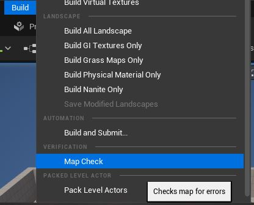
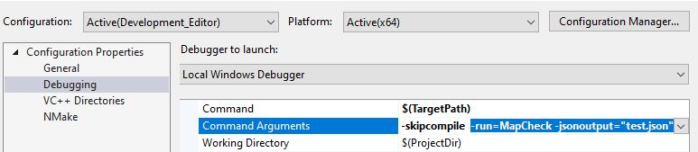
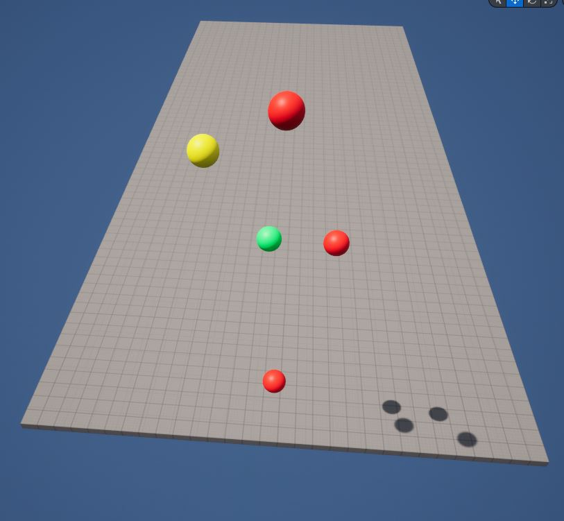
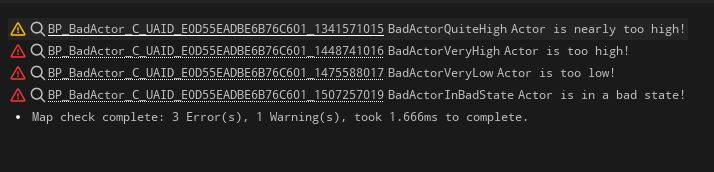

# Unreal Map Check Automation
Map Check automation tooling for Unreal Engine development.

## Map Check overview

Map Check is a error checking tool for your levels while developing in the Unreal Editor.
You can find details about how this works on
[Unreal's documentation](https://docs.unrealengine.com/latest/en-US/map-check-errors-in-unreal-engine/).

The normal way to run Map Check is to navigate to Build -> Map Check while you have
a level open in the editor.



Among some other generic things, this iterates over all
the actors you have in a scene and calls the `CheckForErrors` method, which traditionally
populates information into a MapCheck `FMessageLog`. 

## Running the Commandlet

Running this process via a commandlet allows for headless operation (ie without the Unreal
Editor window needing to open). This pairs nicely with your build machines, and the
commandlet can even produce a JSON file of warnings and errors for you to parse.



To run a commandlet through the editor, pass the argument `-run=MapCheck`. This is based off
of the name of the commandlet, so if you do locally make changes to the name, you will need
to update any script that requires this argument. As seen in the above image, you can
append additional arguments to further control output of the commandlet. You may prefer to
parse the logged output of the execution.

By default, the parameter for `jsonoutput` is appended to the Project's Saved Data are (this
is often excluded from version control considerations).

## Dependencies

`MapCheckAutomation.Build.cs`/`.cpp`/`.h` files are included in this repository in case you
want to use this as a module by itself.

Within your `.uproject` you can add the module like:

```
"Modules": [
	...
	{
		"Name": "MapCheckAutomation",
		"Type": "Editor",
		"LoadingPhase": "Default"
	}
],
```

## Implementing MapChecks

See the [BadActor](MapCheckExample/BadActor.cpp) example for how you can implement MapCheck
via [CheckForErrors](https://docs.unrealengine.com/latest/en-US/API/Runtime/Engine/GameFramework/AActor/CheckForErrors/).

The below image shows some actors that are being checked by the requirements in `BadActor.cpp`,
with corresponding colour highlighting for if they are producing errors (Red) or warnings
(Yellow).



By including a `FUObjectToken`s in your Map Checking logic, you make it much easier
to track down your issues in editor, since clicking on these tokens will refocus your editor
to the appropriate object.



